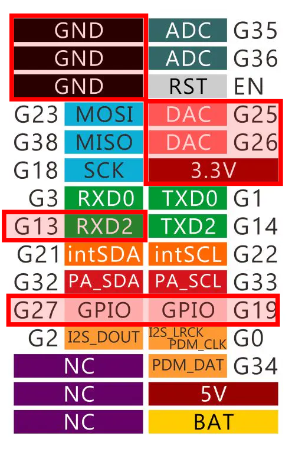

# DC Motor GUI

Repo for the DC motor GUI

## Firmware

### Prepare the Arduino IDE

Follow the installation steps described in this guide.

1. Install Arduino IDE: Download it from [this link](https://www.arduino.cc/en/software/).
2. Install the M5Stack board family:

    

    You need to copy/paste this text to download the board package

    ```txt
    https://static-cdn.m5stack.com/resource/arduino/package_m5stack_index.json 
    ```

    

    Once the board package address is set, you can install it from the *boards manager*.
    


    Once installed, you can select M5Core2 from the board selection menu.

    

3. Install the Arduino libraries for M5Core2:

    

    **WARNING:** When you press *Install*, you'll see the list of dependencies. You *MUST* install all the dependencies too.


4. Install the CP2104 driver (USB driver):

    - **Windows:** Download it from [this link](https://m5stack.oss-cn-shenzhen.aliyuncs.com/resource/drivers/CP210x_VCP_Windows.zip) 
    - **MacOS:** Download it from [this link](https://m5stack.oss-cn-shenzhen.aliyuncs.com/resource/drivers/CP210x_VCP_MacOS.zip) if 
    - **Ubuntu:** Download it from [this link](https://m5stack.oss-cn-shenzhen.aliyuncs.com/resource/drivers/CP210x_VCP_Linux.zip) 

    More info about USB driver installation [here](https://docs.m5stack.com/en/arduino/m5core2/program#2.usb%20driver%20installation).

    Now, when you connect the M5Core2 devide to the PC with the USB cable, you can select the port in the Arduino IDE.

    

    **WARNING:** 
        - In windows, the port is called *COMX*, where *X* is a number that can vary from time to time, e.g., *COM5*.
        - In linux, the port is called "ttyUSBX" or "ttyACMX", where *X* is a number that can vary from time to time, e.g., *ttyUSB2*.

5. Compile and upload the `hello_world.ino` example from *M5Core2* library:

    

    You can press the *Upload* (in red) button to compile and load the program to the device. Note that the button on the left (*Verify* - in green) compiles the program but doesn't upload it to the device.

    

6. *OPTIONAL:* You can open other examples if you want to see the potential of M5Core2. You can try this one:

    


    **Additional resources:**  [Here](https://docs.m5stack.com/en/core/core2) you can find more documentation about some of the basic functions of M5Core2.  

**Pinout and Important Notes**
Below is the M5Core2 pinout. The pins marked in red are the ones used in the DC Motor



!!! warning
    - Some *pins* on the M5Core2 are preconfigured, so pay attention when connecting external components.
    - The ESP32 inside the M5Core2 has 3 serial ports:
          - `Serial1` is reserved for the display (do not use it).
          - `Serial0` can be configured (pins `G3 – RXD0` and `G1 – TXD0`), but it is reserved for USB connection to the PC.
          - `Serial2` is free and can be configured (pins `G13 – RXD2` and `G14 – TXD2`) as regular GPIO using `pinMode()`.

## Software

### Install requirements
Install the python requirements for the GUI:

```bash
pip install -r requirements.txt
```

### Create a .exe (for windows)

Install `pyinstaller`

```bash
pip install pyinstaller
```

Generate the .exe file

First, go to where the .py file is, and then:

```bash
pyinstaller --onefile -w data_collection_gui.py
```

Once finished, the application file is inside the `dist` folder.
