# DC Open-source, portable, and low-cost educational kit for engineering control courses


[](https://github.com/jmgandarias/dc_motor_GUI/stargazers)
[](https://github.com/jmgandarias/dc_motor_GUI/network/members)
[](https://github.com/jmgandarias/dc_motor_GUI/issues)
[](https://github.com/jmgandarias/dc_motor_GUI/blob/main/LICENSE)
[](https://github.com/jmgandarias/dc_motor_GUI/releases)
[](https://github.com/jmgandarias/dc_motor_GUI)

This repository combines:
- ESP32/M5Core2 firmware for DC motor control and data acquisition.
- A Python GUI to configure experiments, run tests, and save results.
- A serial communication pipeline for real-time monitoring and logging.

## Project Purpose

The project provides a reproducible and practical framework so students can:
- Configure control modes (`open-loop`, `position`, `velocity`).
- Run experiments with multiple input signals (`step`, `ramp`, `manual`).
- Export experiment data for post-processing.
- Connect control theory with embedded implementation and real measurements.

## System Architecture

The system has three layers:

1. ESP32/M5Core2 firmware.
2. Serial communication between PC and the selected board (ESP32 or M5Core2).
3. Python GUI for operation, visualization, and storage.

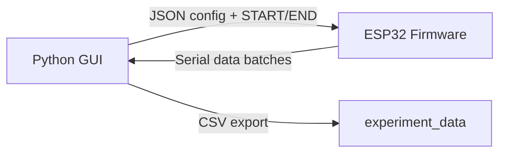
```mermaid
flowchart LR
    A[Python GUI] -->|JSON config + START/END| B[ESP32 Firmware]
    B -->|Serial data batches| A
    A -->|CSV export| C[experiment_data]
```

## Repository Structure

```text
.
|-- config/
|   `-- config.json
|-- experiment_data/
|   `-- *.csv
|-- firmware/
|   |-- firmware_M5.ino
|   `-- firmware_ESP32.ino
|-- images/
|-- dc_motor_gui.py
|-- send_json.py
|-- requirements.txt
`-- README.md
```

### Key Components

- `config/`
  - `config.json`: experiment and controller parameters generated and updated from the GUI.
- `firmware/`
  - `firmware_M5.ino`: M5Core2 version (includes display/touch logic through `DisplayTask`).
  - `firmware_ESP32.ino`: generic ESP32 version (no display task, no M5-specific dependencies).
- `dc_motor_gui.py`
  - Main desktop app to connect, configure, run, stop, visualize, and save experiments.
- `experiment_data/`
  - CSV output files generated from experiments.
- `send_json.py`
  - Utility script to send JSON configuration over serial.

## Requirements

### Hardware

- 12 V / 5 A power supply (the required supply depends on the motor used)
- L298N H-bridge driver
- 12 V DC motor
- ESP32 or M5Core2
- Small prototyping board
- DC jack power connector
- Square ON/OFF switch
- USB cable for serial connection to the PC

### Software

- Arduino IDE
- Python 3.10+ (recommended)
- Python dependencies listed in `requirements.txt`
- CP210x USB driver (if required by your OS)

## Hardware Description

The kit is built around a low-cost DC motor control architecture suitable for educational laboratories.

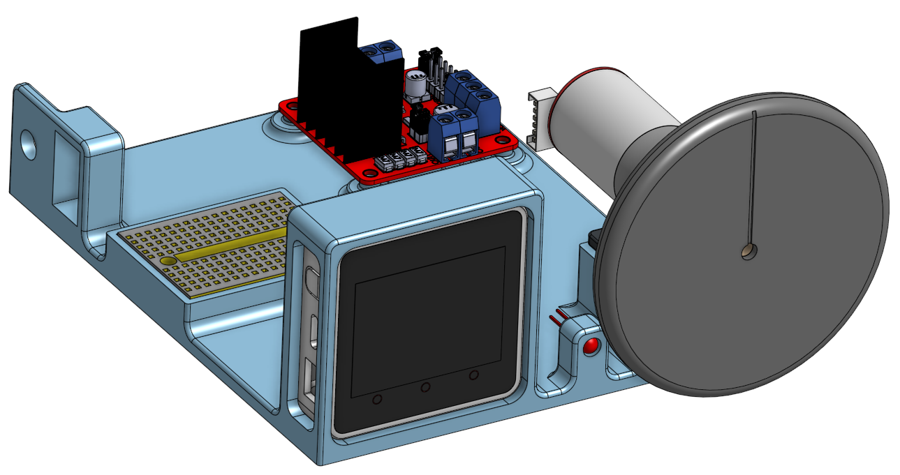

Main hardware blocks:
- Power stage: external 12 V supply and L298N H-bridge for motor actuation.
- Control and acquisition: ESP32/M5Core2 running the firmware.
- Integration elements: prototyping board, DC jack input, and dedicated ON/OFF switch.
- Mechanical parts: [base](https://cad.onshape.com/documents/68744c2d9d57a115c5be415b/w/ec99c6ff019e2c161f3202af/e/f19522d12bc2ccb0db4a4fea) and [wheel](https://cad.onshape.com/documents/8acf9963d988a95b0fc5bd3a/w/932db805f70a48a786458306/e/d399924528139fa77ffa1802) CAD files are publicly available.
- The CAD base is designed for the M5Core2-based assembly.

### Simplified Wiring (Hardware Setup)

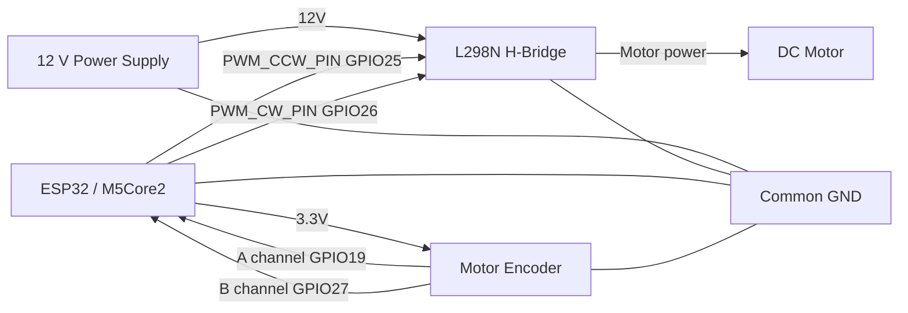
```mermaid
flowchart LR;
  PS[12 V Power Supply] -->|12V| HB[L298N H-Bridge];
  HB -->|Motor power| M[DC Motor];

  MCU[ESP32 / M5Core2] -->|PWM_CCW_PIN GPIO25| HB;
  MCU -->|PWM_CW_PIN GPIO26| HB;

  MCU -->|3.3V| ENC[Motor Encoder];
  ENC -->|A channel GPIO19| MCU;
  ENC -->|B channel GPIO27| MCU;

  GND[Common GND];
  PS --- GND;
  HB --- GND;
  MCU --- GND;
  ENC --- GND;
```

Pin mapping summary:

| Signal | Firmware symbol | MCU pin |
|---|---|---|
| H-bridge PWM (CCW) | `PWM_CCW_PIN` | GPIO25 |
| H-bridge PWM (CW) | `PWM_CW_PIN` | GPIO26 |
| Encoder channel A | `ENCODER_A` | GPIO19 |
| Encoder channel B | `ENCODER_B` | GPIO27 |

Connection notes:
- The H-bridge receives 12 V from the external power supply.
- The H-bridge motor outputs are connected to the motor power pins.
- The ESP32/M5Core2 drives the H-bridge with two PWM signals:
  - `PWM_CCW_PIN` on GPIO25
  - `PWM_CW_PIN` on GPIO26
- The motor encoder is powered from 3.3 V provided by the ESP32/M5Core2.
- Encoder signals are connected as follows:
  - Channel A to GPIO19 (`ENCODER_A`)
  - Channel B to GPIO27 (`ENCODER_B`)
- Ground must be shared by power supply, H-bridge, ESP32/M5Core2, and encoder.

Important operating note:
- This setup is designed to run connected to a PC through USB serial, with the GUI managing configuration, start/stop commands, and data logging.
- It is not intended to operate as a fully standalone kit without a host PC.

## Firmware Setup (Detailed)

This section keeps the full step-by-step firmware setup flow.

### Firmware Variants

- Use `firmware/firmware_M5.ino` when your device is M5Core2.
- Use `firmware/firmware_ESP32.ino` when using a standard ESP32 board.
- The ESP32 variant removes `DisplayTask` and all M5 display/touch dependencies.

### 1) Install Arduino IDE

Download and install from:
https://www.arduino.cc/en/software/

### M5Core2-only preparation (steps 2 to 5)

The following steps (2 to 5) apply only to the M5Core2 workflow. If you are using a standard ESP32 board, go directly to step 6 and use `firmware/firmware_ESP32.ino`.

### 2) Install M5Stack board package

Add this board manager URL:

```txt
https://static-cdn.m5stack.com/resource/arduino/package_m5stack_index.json
```

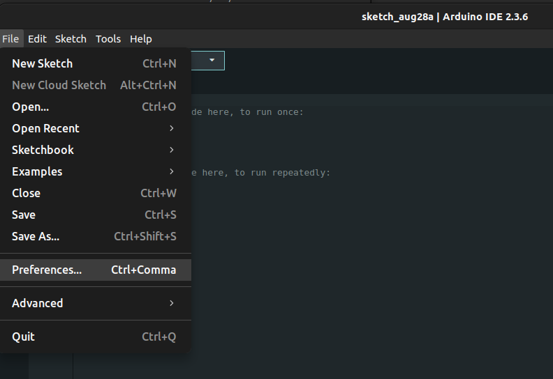
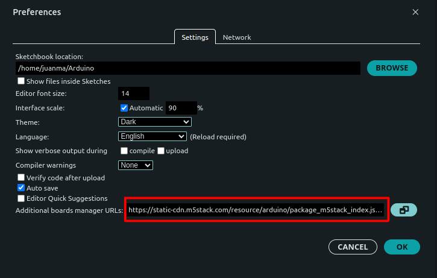
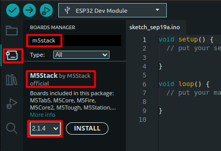

After installation, select the M5Core2 board:

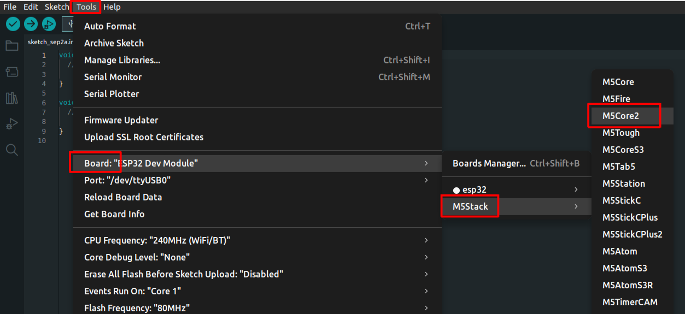

### 3) Install required Arduino libraries

Install M5Core2-related libraries and all dependencies.

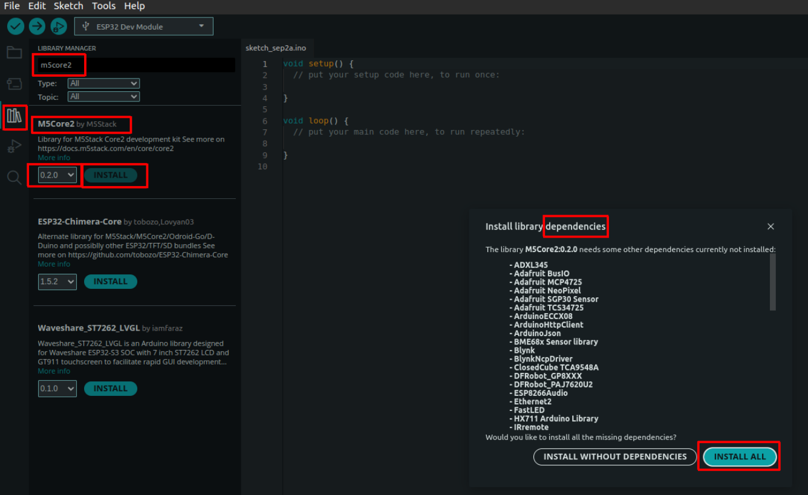

Important:
- When prompted, install all dependent libraries too.

### 4) Install CP210x USB driver

- Windows: https://m5stack.oss-cn-shenzhen.aliyuncs.com/resource/drivers/CP210x_VCP_Windows.zip
- macOS: https://m5stack.oss-cn-shenzhen.aliyuncs.com/resource/drivers/CP210x_VCP_MacOS.zip
- Linux: https://m5stack.oss-cn-shenzhen.aliyuncs.com/resource/drivers/CP210x_VCP_Linux.zip

Additional reference:
https://docs.m5stack.com/en/arduino/m5core2/program#2.usb%20driver%20installation

Port selection example:

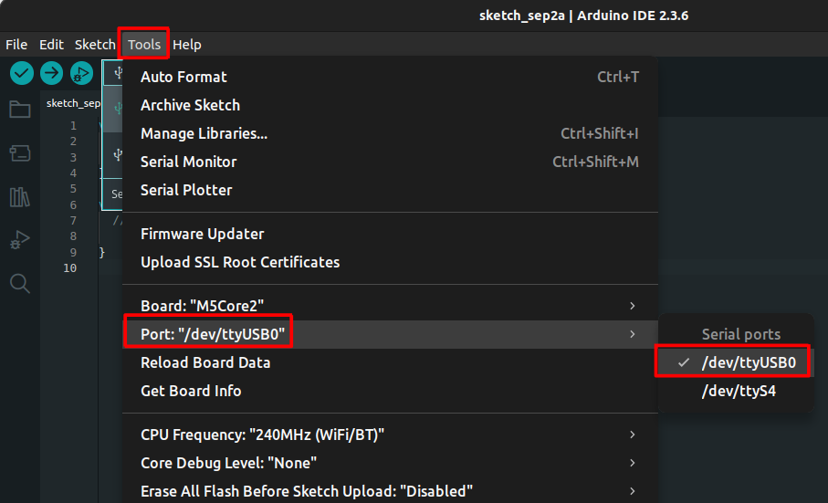

Notes:
- On Windows, the port is usually `COMx` (for example, `COM5`).
- On Linux, it is usually `ttyUSBx` or `ttyACMx`.

### 5) Verify toolchain with an example sketch (recommended)

Compile and upload the `hello_world.ino` example from the M5Core2 library first.

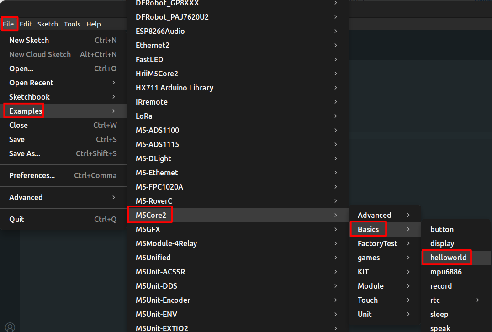
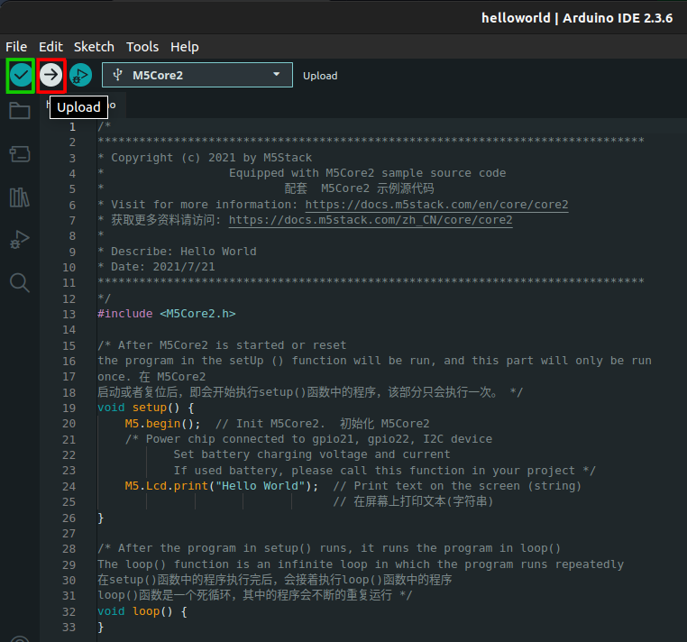

### 6) Upload this project firmware

1. Open the firmware that matches your board:
  - `firmware/firmware_M5.ino` for M5Core2
  - `firmware/firmware_ESP32.ino` for standard ESP32
2. Select board and serial port.
3. Compile and upload.
4. Open Serial Monitor and verify the `READY` message appears.

### Pinout and important notes

Below is the M5Core2 pinout (the red pins are used in this project):

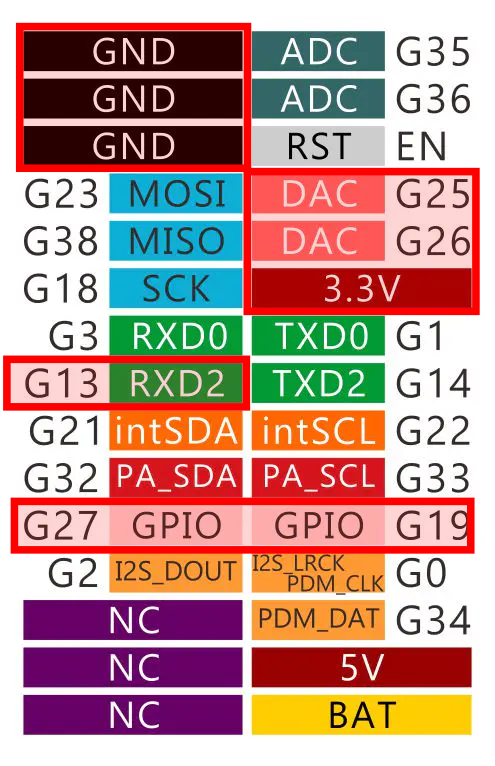

Warnings:
- Some M5Core2 pins are preconfigured, so verify wiring carefully.
- ESP32 serial ports:
  - `Serial1` is reserved for the display.
  - `Serial0` is used for USB communication to the PC.
  - `Serial2` is available for general use.

## GUI Setup

Install Python dependencies:

```bash
pip install -r requirements.txt
```

Run the GUI:

```bash
python dc_motor_gui.py
```

## How To Use

Recommended experiment workflow:

1. Connect the board and open the GUI.
2. Select serial port and baud rate.
3. Click `Connect`.
4. Configure:
   - `control_mode`: `open-loop`, `position`, `velocity`
   - `input_signal`: `step`, `ramp`, `manual`
   - PID gains (`Kp`, `Ki`, `Kd`) when applicable
   - `experiment_duration` and `sampling_rate`
5. Click `Send Config`.
6. Click `Start Experiment`.
7. Click `Stop` at any time to end the run.
8. Click `Save` to export collected data to CSV.

Note:
- `Stop` halts the experiment without clearing in-memory data, so saving afterward is supported.
- `config/config.json` is edited through the GUI controls and `Send Config`; manual file editing is not required.

## Configuration File (`config/config.json`)

This file is managed directly from the GUI. In normal usage, you should configure parameters in the application and click `Send Config`; manual editing is optional and generally unnecessary.

Common fields:
- `control_mode`
- `input_signal`
- `ref`
- `Kp`, `Ki`, `Kd`
- `experiment_duration`
- `sampling_rate`
- `dead_zone_compensation`

Example:

```json
{
  "control_mode": "position",
  "input_signal": "step",
  "ref": 0.0,
  "Kp": 1.0,
  "Ki": 0.0,
  "Kd": 0.0,
  "experiment_duration": 10.0,
  "sampling_rate": 0.01,
  "dead_zone_compensation": true
}
```

## Experiment Data

Results are stored in `experiment_data/` as CSV files, ready for analysis in Python, MATLAB/Octave, or Excel.

Expected CSV columns:
- `voltage`
- `pos_rad`
- `vel_rad_per_s`
- `vel_filtered_rad_per_s`
- `ref`
- `time_ms`

## Educational Use Cases

This repository is intended for lab sessions and project-based learning in:
- Control engineering
- Industrial informatics
- Robotics

Suggested academic activities:
- Compare open-loop and closed-loop behavior.
- Tune PID controllers and evaluate transient response.
- Analyze the effect of sampling time and velocity filtering.
- Build end-to-end traceability from control command to stored dataset.

## Optional: Build a Windows Executable

```bash
pip install pyinstaller
pyinstaller --onefile -w dc_motor_gui.py
```

The executable will be generated in `dist/`.
